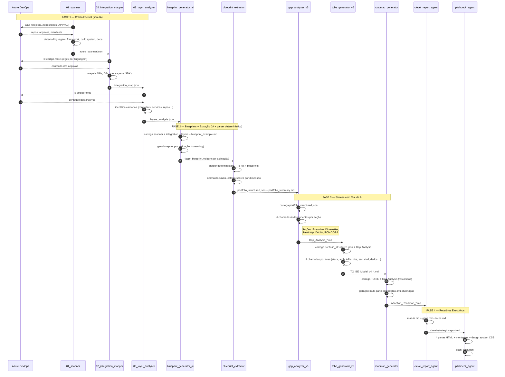

# Pipeline de Engenharia Reversa Arquitetural

> Reconstrução automatizada da arquitetura real de ecossistemas tecnológicos distribuídos — diretamente do código, sem entrevistas, sem workshops.

---

## O Problema

Organizações com portfólios de dezenas ou centenas de aplicações acumulam uma **complexidade invisível**: ninguém tem uma visão completa e confiável de como os sistemas realmente funcionam, quais são suas dependências, onde estão os riscos, e o que seria necessário para evoluir. Documentações existentes estão defasadas. O conhecimento está fragmentado entre times. Qualquer processo de levantamento manual é lento, subjetivo e politicamente contaminado.

## A Solução

Este pipeline transforma engenharia reversa arquitetural de um processo manual e subjetivo em um processo **automatizado, técnico e rastreável**. A IA é usada como mecanismo de síntese — não como fonte de verdade. A base factual vem inteiramente do código.

O resultado são artefatos prontos para decisão executiva:

- **Blueprints AS-IS** por aplicação (estado atual, evidenciado pelo código)
- **Modelo TO-BE** consolidado (arquitetura futura recomendada)
- **Análise de Gaps** estruturada (AS-IS vs. TO-BE, com referências a benchmarks de mercado)
- **Roadmap de Adoção** (iniciativas priorizadas por impacto e dependência)
- **Relatório C-Level** e **Pitch Deck HTML** (para audiência executiva)

---

## Arquitetura da Solução

### Visão Geral do Pipeline



---

### Diagrama de Fluxo

```
┌─────────────────────────────────────────────────────────────┐
│              FONTE DE VERDADE: Azure DevOps                 │
│         (código, pipelines CI/CD, configurações)            │
└──────────────────────┬──────────────────────────────────────┘
                       │
          ┌────────────▼────────────┐
          │   01_scanner.py         │
          │   Inventário de repos   │
          │   Linguagens, deps,     │
          │   frameworks, CI/CD     │
          └────────────┬────────────┘
                       │ azure_scanner.json
          ┌────────────▼────────────┐
          │   02_integration_mapper │
          │   Padrões de integração │
          │   APIs, DBs, mensageria │
          │   SDKs de terceiros     │
          └────────────┬────────────┘
                       │ integration_map.json
          ┌────────────▼────────────┐
          │   03_layer_analyzer     │
          │   Camadas arquiteturais │
          │   Controllers, Services │
          │   Repos, Entities, DTOs │
          └────────────┬────────────┘
                       │ layers_analysis.json
                       │
         ══════════════╪══════════════
          BASE FACTUAL  │  (somente dados do código)
         ══════════════╪══════════════
                       │
          ┌────────────▼────────────┐
          │  blueprint_generator_ai │  ← usa blueprint_example.md
          │  Blueprint por app      │     como referência de estrutura
          │  (síntese via Claude AI) │
          └────────────┬────────────┘
                       │ {app}_blueprint.md (por aplicação)
                       │
          ┌────────────▼────────────┐
          │   blueprint_extractor   │
          │   Parser determinístico │
          │   Scores por dimensão   │
          └────────────┬────────────┘
                       │ portfolio_structured.json
                       │ portfolio_summary.md
                       │
         ══════════════╪══════════════
          BASE FACTUAL  │  completa para síntese IA
         ══════════════╪══════════════
                       │
          ┌────────────▼────────────┐
          │   gap_analyzer_v5       │
          │   Gaps por dimensão     │
          │   ROI + Benchmarks DORA │
          └────────────┬────────────┘
                       │ Gap_Analysis_*.md
                       │
          ┌────────────▼────────────┐
          │   tobe_generator_v5     │
          │   Modelo TO-BE          │
          │   (informado pelos gaps) │
          └────────────┬────────────┘
                       │ TO_BE_Model_v4_*.md
                       │
          ┌────────────▼────────────┐
          │   roadmap_generator     │
          │   Iniciativas x Ondas   │
          │   Dependências e KPIs   │
          └────────────┬────────────┘
                       │ Adoption_Roadmap_*.md
                       │
          ┌────────────┴────────────┐
          │                         │
   ┌──────▼──────┐         ┌────────▼────────┐
   │  clevel_    │         │  pitchdeck_     │
   │  report_    │         │  agent          │
   │  agent      │         │  Deck HTML      │
   │  Relatório  │         │  executivo      │
   │  executivo  │         │  (4 partes +    │
   │  Markdown   │         │   montagem)     │
   └─────────────┘         └─────────────────┘
```

### Estágios em Detalhe

#### Estágio 1 — Scanner (`01_scanner.py`)

Conecta à Azure DevOps REST API v7.0 e faz inventário de todos os repositórios da organização.

Para cada repositório, detecta automaticamente:

| O que detecta | Como detecta |
|---|---|
| Linguagem principal | Presença de `package.json`, `pom.xml`, `go.mod`, `*.csproj`, etc. |
| Build system | Maven, Gradle, NPM/Yarn, MSBuild, Cargo, Go Modules, Docker |
| Frameworks | NestJS, Spring Boot, Express, React, Angular, FastAPI, ASP.NET Core, etc. |
| Tipo do projeto | API/Backend, Frontend/SPA, Worker, IaC, Kubernetes/Helm, Library/SDK |
| Dependências | Runtime e dev, parseadas de cada manifest por linguagem |
| Estrutura de pastas | Presença de `tests/`, `docs/`, CI/CD, padrões DDD, MVC, etc. |

Pastas varridas: `src`, `devops`, `configs`, `.github`, `.azure`, `infrastructure`, `helm`, `charts` (profundidade máxima: 3 níveis).

Saída: `outputs/json/azure_scanner.json`

---

#### Estágio 2 — Integration Mapper (`02_integration_mapper.py`)

Analisa o código-fonte de cada repositório aplicando **padrões de regex por linguagem e framework** para identificar integrações reais.

Padrões cobertos:

- **NestJS/TypeScript**: decorators `@Query`, `@Mutation`, `@Controller`, `@Injectable`, `@UseGuards`, GraphQL types
- **Spring Boot/Java**: `@RestController`, `@KafkaListener`, `@RabbitListener`, `@Entity`, `@Transactional`, `@PreAuthorize`
- **Python, Go, Rust, C#, PHP, Elixir**: padrões equivalentes por ecosistema
- **Integrações externas**: chamadas HTTP/REST, clientes de banco de dados, SDKs de cloud, brokers de mensageria

Saída: `outputs/json/integration_map.json`

---

#### Estágio 3 — Layer Analyzer (`03_layer_analyzer.py`)

Reconstrói as camadas arquiteturais de cada aplicação com base em padrões estruturais do código.

Camadas identificadas:

```
controllers   → @Controller, class *Controller, export class *Controller
services      → @Injectable, @Service, class *Service
repositories  → @Repository, @InjectRepository, class *Repository
entities      → @Entity, class *Entity, *.entity.*
dtos          → class *Dto, *.dto.*, interface *Dto
models        → class *Model, *.model.*
resolvers     → @Resolver, @Query (GraphQL)
guards        → @Guard, @UseGuards
middlewares   → @Middleware, use()
interceptors  → @Interceptor, @UseInterceptors
pipes         → @Pipe, @UsePipes
modules       → @Module
```

Saída: `outputs/json/layers_analysis.json`

---

#### Estágio 4 — Blueprint Generator (`blueprint_generator_ai.py`)

Usa Claude AI para sintetizar um **Blueprint detalhado por aplicação** a partir dos dados coletados nos estágios 1–3. O arquivo `blueprint_example.md` é injetado como exemplo few-shot para garantir consistência de estrutura e estilo entre os blueprints.

Cada blueprint contém:
- Visão geral da arquitetura com diagrama Mermaid
- Diagrama de contexto (Nível 1) e de container (Nível 2)
- Tecnologias e frameworks com justificativa
- Padrões arquiteturais identificados
- Integrações e dependências externas
- Considerações de infraestrutura e CI/CD

Saída: `outputs/{projeto}/blueprints/{app}_blueprint.md`

---

#### Estágio 5 — Blueprint Extractor (`blueprint_extractor.py`)

Parser **determinístico** (sem IA) que lê os blueprints e os arquivos `.txt` de cada aplicação e produz a base factual estruturada para as etapas de IA subsequentes.

Para cada aplicação extrai e normaliza:
- Sinais de tecnologia (stack, testes, observabilidade, segurança, CI/CD, dados)
- Score de maturidade por dimensão (0–5) com cálculo auditável
- Contagem de gaps críticos e lista de sinais ausentes

Saídas:
- `outputs/portfolio_structured.json` — entrada obrigatória do `gap_analyzer_v5` e do `tobe_generator_v5`
- `outputs/portfolio_summary.md` — tabela auditável para revisão humana

---

#### Estágio 6 — Gap Analyzer (`gap_analyzer_v5.py`)

Gera análise de gaps estruturada em **6 chamadas independentes**, cada uma responsável por uma seção:

1. Sumário Executivo + TOP 10 Gaps
2. Análise por Dimensão: Observabilidade, Segurança, Cloud, APIs, Qualidade
3. Análise por Dimensão: CI/CD, Arquitetura, Documentação + Padrões
4. Distribuição Quantitativa + Heatmap + Matriz de Priorização
5. Débito Técnico + Recomendações + Roadmap Inicial + Conclusão
6. ROI e Dimensionamento de Esforço (com benchmarks de mercado)

Benchmarks injetados automaticamente na seção de ROI:
- **DORA State of DevOps** (2022/2023) — frequência de deploy, MTTR
- **NIST SP 800-64 Rev.2** — custo de vulnerabilidades
- **Accelerate** (Forsgren, Humble, Kim) — impacto de práticas DevOps
- **CISQ Cost of Poor Software Quality** (2022)
- **Verizon DBIR 2023 / GitGuardian 2023**

Entrada obrigatória: `outputs/portfolio_structured.json`  
Entrada opcional: `outputs/portfolio_summary.md`

Saída: `outputs/Gap_Analysis_*.md`

---

#### Estágio 7 — TO-BE Generator (`tobe_generator_v5.py`)

Gera o modelo de arquitetura futura **informado pela análise de gaps** — cada decisão técnica referencia explicitamente o gap que resolve e as aplicações afetadas. Usa **9 chamadas independentes** (uma por área: sumário, arquitetura de referência, stack, APIs, observabilidade, segurança, CI/CD, dados, capacidades e roadmap).

Entradas obrigatórias: `outputs/portfolio_structured.json` + `outputs/Gap_Analysis_*.md` (mais recente).  
Entrada opcional: `outputs/Concept_NAV_360.md` (visão estratégica de negócio).

Saída: `outputs/TO_BE_Model_v4_*.md`

---

#### Estágio 8 — Roadmap Generator (`roadmap_generator.py`)

Gera o roadmap de adoção em múltiplas partes. Cada iniciativa obrigatoriamente cita o gap que endereça. Valores financeiros só são incluídos se explicitamente presentes nos dados de entrada — caso contrário, usa `⚠️ Financeiro: TBD`.

Entradas: `TO_BE_Model_*.md` + `Gap_Analysis_*.md` (arquivos mais recentes).

Saída: `outputs/Adoption_Roadmap_*.md`

---

#### Agentes de Relatório Executivo

| Agente | Entrada | Saída |
|---|---|---|
| `clevel_report_agent.py` | `outputs/reports/as-is.md`, `gaps.md`, `to-be.md` | `outputs/reports/clevel-strategic-report.md` |
| `pitchdeck_agent.py` | Relatório C-Level (Markdown) | `outputs/pitch_deck.html` |

O pitch deck é gerado em **4 partes HTML independentes** e montado pelo Python com um design system CSS embutido (fontes Sora + DM Sans, paleta de cores corporativa).

---

## Princípios de Design

### Anti-Alucinação

Toda geração via IA segue regras explícitas injetadas nos system prompts:

1. Cada afirmação deve citar a fonte nos dados de entrada
2. Aplicações, gaps e iniciativas só podem referenciar o que existe nos JSONs
3. Valores monetários são proibidos sem base comprovável nos dados — use `TBD`
4. Benchmarks de mercado são permitidos apenas nas seções explicitamente designadas, com citação da fonte a cada uso

### Auditabilidade

Todos os artefatos gerados são arquivos texto (Markdown, JSON, HTML) — versionáveis, revisáveis e rastreáveis. O índice em `outputs/INDEX.md` consolida toda a documentação gerada com links diretos.

### Modularidade

Cada estágio pode ser executado de forma independente. O orquestrador detecta automaticamente artefatos já existentes e oferece a opção de pular ou regenerar. Isso permite re-executar apenas o estágio que mudou sem refazer todo o pipeline.

---

## Dependências

```
anthropic          # Cliente Claude API
requests           # Chamadas à Azure DevOps REST API
python-dotenv      # Carregamento de variáveis de ambiente do .env
```

Instalar:
```bash
pip install anthropic requests python-dotenv
```

---

## Configuração

Crie um arquivo `.env` na raiz do projeto:

```env
ANTHROPIC_API_KEY=sk-ant-...          # Obrigatório
AZDO_ORG=nome-da-organizacao          # Obrigatório para os estágios 1–3
AZDO_PAT=personal-access-token        # Obrigatório para os estágios 1–3
OUTPUT_DIR=outputs                    # Opcional, padrão: outputs
```

O token PAT do Azure DevOps precisa de permissão de leitura em **Code** (repositórios Git).

O modelo Claude configurado em `core/llm.py` é `claude-sonnet-4-20250514` com `MAX_TOKENS = 16000` por chamada. O `gap_analyzer_v5.py` usa `MAX_TOKENS = 8000` por chamada (6 chamadas).

---

## Execução

### Pipeline completo

```bash
python run_transformation_analysis.py
```

O orquestrador:
1. Verifica pré-requisitos (API key, biblioteca `anthropic`, diretório `outputs/`)
2. Pergunta se deve regenerar artefatos existentes em cada estágio
3. Executa os 5 estágios principais em sequência (na ordem correta de dependências)
4. Gera `outputs/INDEX.md` com índice de toda a documentação produzida

### Estágios individuais

```bash
# Coleta de dados (requer Azure DevOps)
python 01_scanner.py
python 02_integration_mapper.py
python 03_layer_analyzer.py

# Blueprints e extração (requer ANTHROPIC_API_KEY + outputs acima)
python blueprint_generator_ai.py
python blueprint_extractor.py         # gera portfolio_structured.json (obrigatório para etapas seguintes)

# Síntese com IA (na ordem correta — gap analysis alimenta o TO-BE)
python gap_analyzer_v5.py
python tobe_generator_v5.py
python roadmap_generator.py

# Relatórios executivos
python clevel_report_agent.py
python pitchdeck_agent.py
```

### Ferramentas auxiliares

```bash
python cross_alignment_analyzer.py    # Análise de alinhamento cruzado entre aplicações
python concept_transcript_analyzer.py # Análise de transcrições e documentos conceituais
python documentation_generator.py     # Geração de documentação por repositório
python mkdocs_generator.py            # Gera site MkDocs com toda a documentação
```

---

## Estrutura de Saídas

```
outputs/
├── INDEX.md                          # Índice de toda a documentação gerada
├── json/
│   ├── azure_scanner.json            # Inventário completo de repositórios
│   ├── integration_map.json          # Mapa de integrações por aplicação
│   └── layers_analysis.json          # Análise de camadas arquiteturais
├── {projeto}/
│   ├── {app}.txt                     # Dados brutos: scanner + integration + layers (3 seções JSON)
│   └── blueprints/
│       └── {app}_blueprint.md        # Blueprint AS-IS por aplicação
├── portfolio_structured.json         # Base factual estruturada (saída do blueprint_extractor)
├── portfolio_summary.md              # Tabela auditável de sinais por aplicação
├── Gap_Analysis_*.md                 # Análise de gaps com benchmarks de mercado
├── TO_BE_Model_v4_*.md               # Modelo de arquitetura futura (informado pelos gaps)
├── Adoption_Roadmap_*.md             # Roadmap de adoção por ondas
├── reports/
│   ├── as-is.md                      # Consolidado AS-IS para relatório C-Level
│   ├── gaps.md                       # Consolidado de gaps para relatório C-Level
│   ├── to-be.md                      # Consolidado TO-BE para relatório C-Level
│   └── clevel-strategic-report.md    # Relatório estratégico C-Level
└── pitch_deck.html                   # Apresentação executiva (HTML standalone)
```

---

## Extensibilidade

O scanner (`01_scanner.py`) foi construído com Azure DevOps como implementação de referência, mas a arquitetura do adapter é extensível para **GitHub**, **Bitbucket**, **Gitea** e **AWS CodeCommit** — basta reimplementar as funções `fetch_files_recursive()` e `fetch_file_content()` para o novo provedor, mantendo o schema de saída `azure_scanner.json`.

O arquivo `blueprint_example.md` é o template de referência para blueprints. Modificá-lo afeta a estrutura de todos os blueprints gerados a partir dele.

---

## Audiências dos Artefatos

| Artefato | Audiência principal |
|---|---|
| Blueprints AS-IS | Tech Leads, Arquitetos |
| Modelo TO-BE | VPs de Engenharia, Arquitetos |
| Análise de Gaps | VPs de Engenharia, PMO, Arquitetos |
| Roadmap de Adoção | PMO, C-Level, VPs |
| Relatório C-Level / Pitch Deck | CEO, CTO, CIO, CFO |
