# Arquitetura da Solução — Knowledge Base Inteligente com RAG
**POC Devolução de Clientes — Grupo Santa Cruz × FCamara**
Versão: 3.0 | Data: Julho/2026 | Classificação: Uso interno restrito

---

## 1. Visão Geral

A solução extrai conhecimento implícito do código-fonte legado dos sistemas do Grupo Santa Cruz e o disponibiliza para consulta em linguagem natural via agente RAG.

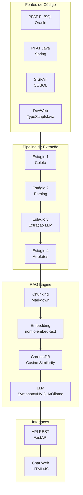

---

## 2. Pipeline de Extração — 4 Estágios

### 2.1 Visão sequencial

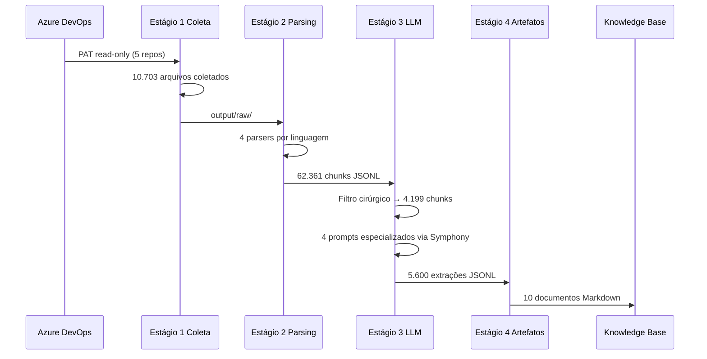

### 2.2 Estágio 1 — Coleta

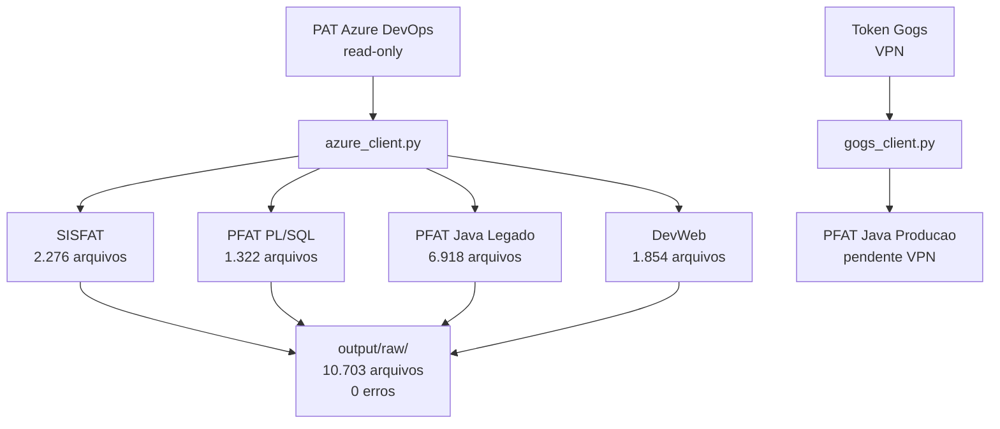

**Decisões técnicas:**
- PAT por repositório — DevWeb tem PAT dedicado diferente dos demais
- `scope_path` por repo — restringe coleta ao diretório de produção
- Fallback de encoding UTF-8 → latin-1 para arquivos COBOL legados
- Suporte a arquivos sem extensão (91 arquivos COBOL AcuCOBOL)

### 2.3 Estágio 2 — Parsing

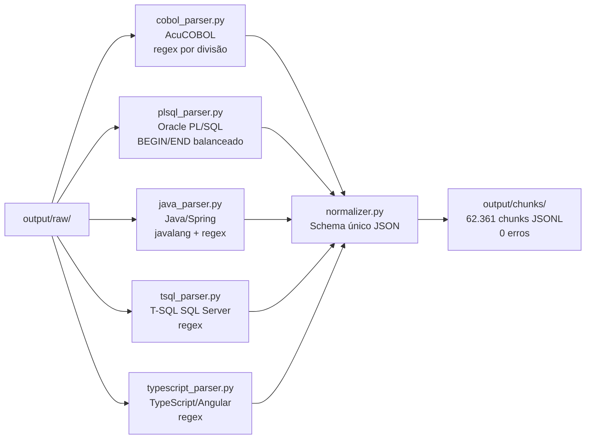

**Volumes por sistema:**

| Sistema | Arquivos | Chunks | Parser |
|---|---|---|---|
| SISFAT (COBOL) | 2.276 | 39.593 | regex AcuCOBOL |
| PFAT Java | 7.105 | 20.106 | javalang + fallback |
| PFAT PL/SQL | 1.322 | 2.662 | sqlparse + BEGIN/END balanceado |
| DevWeb | 1.854 | 2.478 | typescript + java + tsql |

**Descobertas na fase de parsing:**
- SISFAT identificado como COBOL AcuCOBOL (não Java como descrito inicialmente)
- Extensões não convencionais: `.fd` (FILE DESCRIPTION), `.sl` (SELECT), `.cbl/.cob/.mod`
- PFAT PL/SQL: problema inicial de 83% UNKNOWN corrigido com captura balanceada BEGIN/END
- 2.779 chunks de comentários COBOL descartados pelo normalizer

### 2.4 Estágio 3 — Extração via LLM

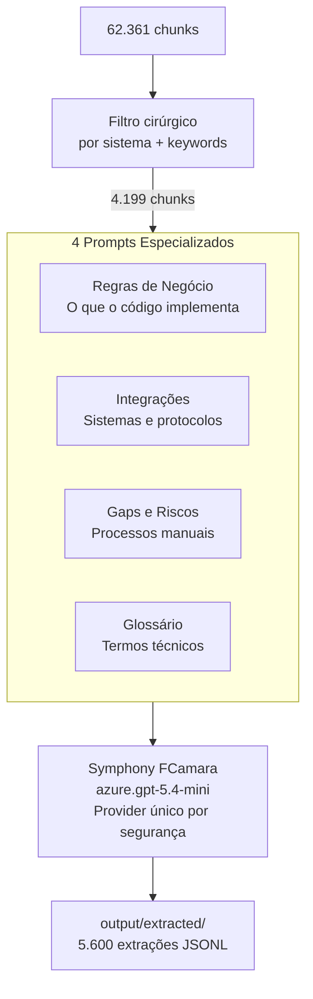

**Filtro cirúrgico por sistema:**

| Sistema | Total chunks | Após filtro | Redução |
|---|---|---|---|
| PFAT PL/SQL | 2.662 | 422 | 84% |
| PFAT Java | 20.106 | 2.333 | 88% |
| SISFAT | 39.593 | 1.444 | 96% |
| DevWeb | 2.478 | 246 | 90% |

**Decisão de segurança:** Symphony FCamara exclusivo como provider LLM no pipeline de extração — instância dedicada, DPA contratual com o Grupo SC, dados nunca saem em código bruto (parser sanitiza antes do envio).

**Checkpoint por chunk** — retomada automática em caso de interrupção (token expirado, timeout, Ctrl+C).

### 2.5 Estágio 4 — Geração de Artefatos

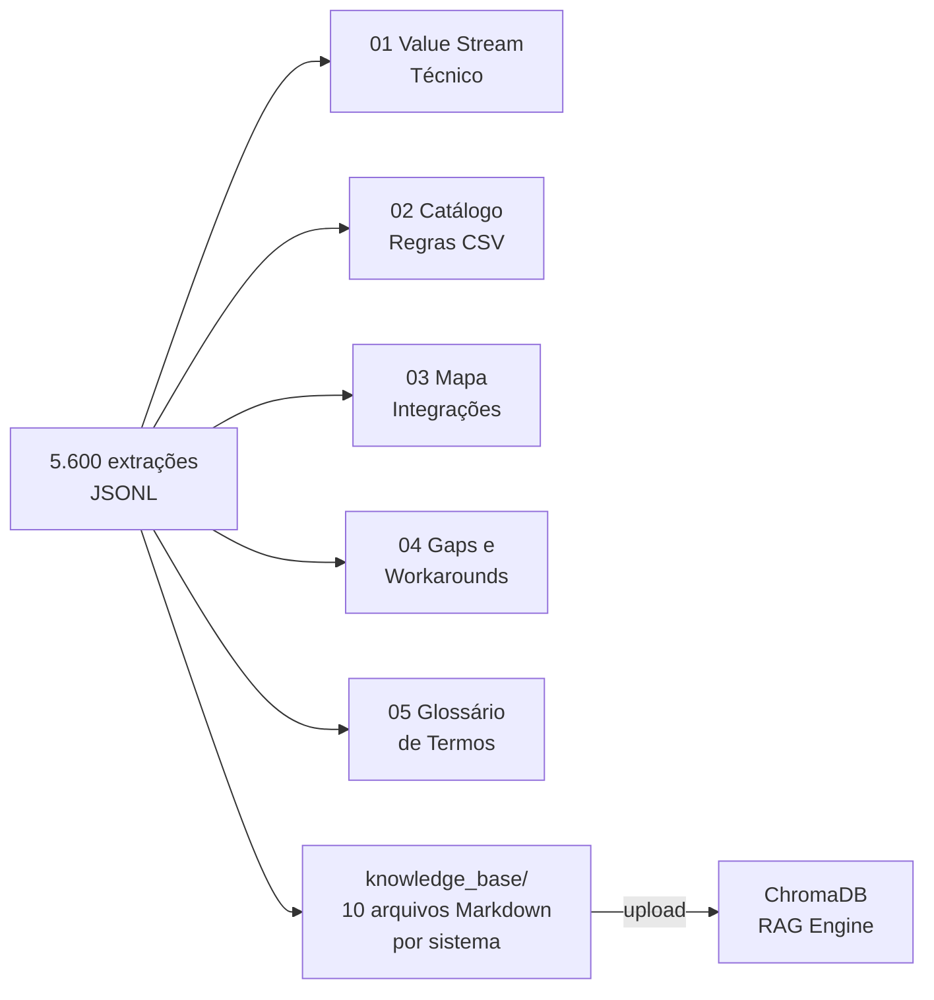

**Artefatos gerados — volumes finais (4 sistemas):**

| Artefato | Entradas |
|---|---|
| 01 Value Stream Técnico | 10.326 regras |
| 02 Catálogo de Regras (CSV) | 10.250 regras |
| 03 Mapa de Integrações | 3.190 integrações |
| 04 Gaps e Workarounds | 9.806 gaps/riscos |
| 05 Glossário de Termos | 14.441 termos |

**Pasta knowledge_base/ — gerada deterministicamente:**
```
output/artifacts/knowledge_base/
├── 02_Regras_PFAT_PLSQL.md     (387 regras)
├── 02_Regras_PFAT_Java.md      (6.285 regras)
├── 02_Regras_SISFAT.md         (3.198 regras)
├── 02_Regras_DevWeb.md         (380 regras)
├── 04_Gaps_PFAT_PLSQL.md
├── 04_Gaps_PFAT_Java.md
├── 04_Gaps_SISFAT.md
├── 04_Gaps_DevWeb.md
├── 03_Map_Integracoes_Impacto.md
└── 05_Glossario_Termos.md
```

---

## 3. RAG Engine

### 3.1 Arquitetura de indexação

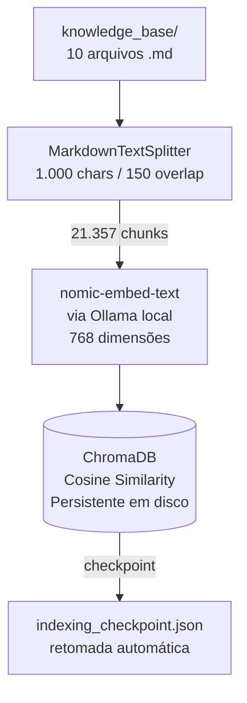

**Decisões de indexação:**
- `MarkdownTextSplitter` em vez de splitter genérico — respeita estrutura de seções `###`
- Cosine similarity em vez de L2 — normaliza vetores, valores entre 0-2 independente da dimensão
- Checkpoint por batch de 100 chunks — retomada se Ollama cair durante indexação
- 21.357 chunks totais indexados

### 3.2 Fluxo de consulta

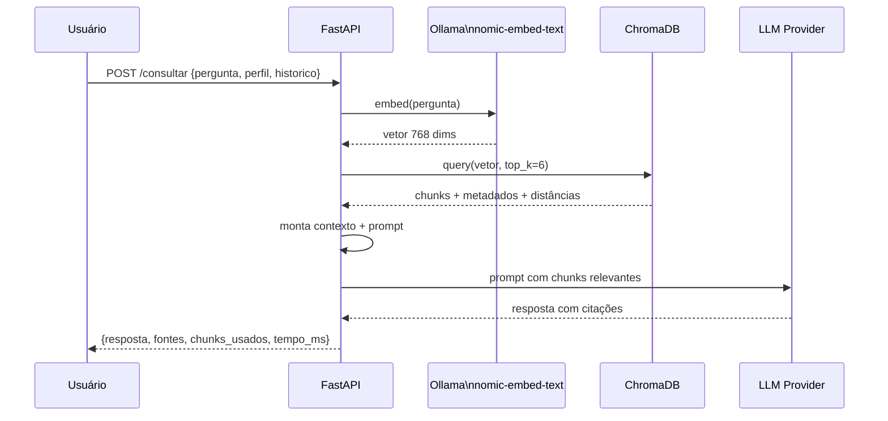

### 3.3 Seleção de provider LLM

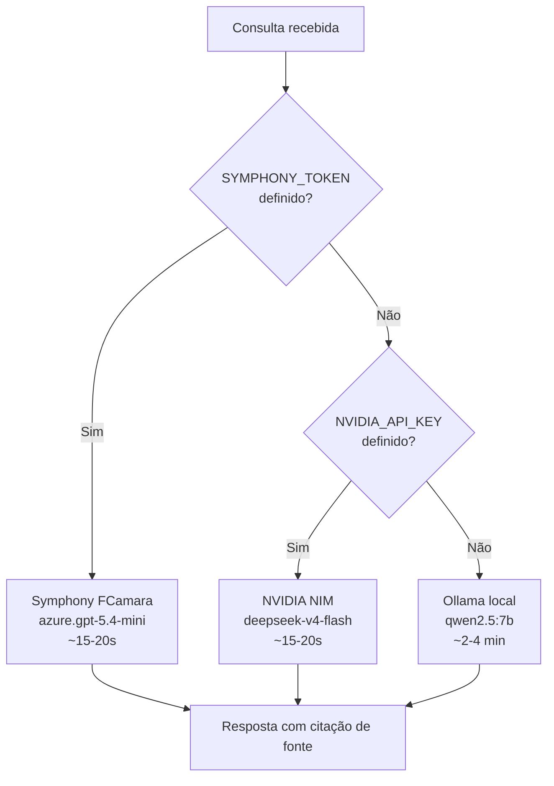

**Importante:** o embedding é **sempre local** via Ollama (`nomic-embed-text`) — os chunks da base de conhecimento nunca saem da máquina. Só o prompt com os trechos já recuperados vai para o provider externo.

### 3.4 Prompt de consulta

```
Sistema: Você é o assistente de conhecimento técnico do processo de
Devolução de Clientes do Grupo Santa Cruz.

Regras:
1. Cite sempre a fonte (sistema e arquivo de origem)
2. Se não estiver nos trechos, diga claramente
3. Não avalie qualidade de código
4. Destaque gaps e riscos quando relevantes

Contexto (chunks recuperados):
[Fonte: 02_Regras_PFAT_Java.md, Sistema: PFAT_Java]
{chunk_1}
---
[Fonte: 04_Gaps_SISFAT.md, Sistema: SISFAT]
{chunk_2}
...

Pergunta: {pergunta_do_usuario}
```

---

## 4. API REST

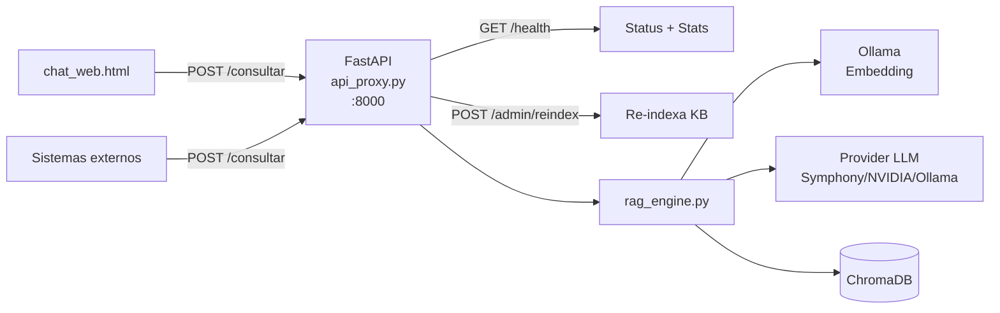

**Endpoints:**

| Método | Endpoint | Descrição |
|---|---|---|
| GET | `/health` | Status da API e stats do RAG (chunks indexados, provider ativo) |
| POST | `/consultar` | Envia pergunta, retorna resposta com fontes |
| POST | `/admin/reindex` | Re-indexa documentos após atualizar artefatos |

**Request /consultar:**
```json
{
  "pergunta": "O que valida o CFOP na devolução?",
  "perfil": "TI",
  "historico": []
}
```

**Response /consultar:**
```json
{
  "resposta": "O CFOP é validado pela rotina NfEspecialCore.validarCFOP... [Fonte: 02_Regras_PFAT_Java.md]",
  "fontes": [{"source": "02_Regras_PFAT_Java.md", "sistema": "PFAT_Java", "distancia": 0.21}],
  "chunks_usados": 6,
  "tempo_ms": 15139,
  "fonte_disponivel": true
}
```

---

## 5. Chat Web

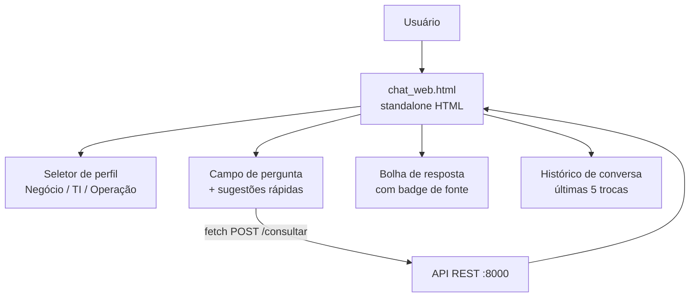

**Características:**
- HTML standalone — abre direto no browser sem servidor web
- Seletor de perfil (Negócio / TI / Operação) — contextualiza o LLM
- Histórico de conversa mantido no browser (últimas 5 trocas)
- Badge visual quando resposta não tem citação de fonte
- Sugestões de prompt pré-configuradas por caso de uso

---

## 6. Decisões Arquiteturais — Resumo

| Decisão | Escolha | Motivação |
|---|---|---|
| Provider LLM extração | Symphony FCamara exclusivo | DPA contratual, instância dedicada, segurança |
| Provider LLM RAG | Symphony > NVIDIA > Ollama | Prioridade por disponibilidade |
| Embedding | nomic-embed-text local | Zero egress — chunks nunca saem da máquina |
| Vector store | ChromaDB persistente | Local, sem servidor separado, cosine similarity |
| Similarity metric | Cosine | Normaliza vetores 768 dims, valores intuitivos 0-2 |
| Chunking | MarkdownTextSplitter 1.000/150 | Respeita estrutura semântica dos artefatos |
| Filtro de chunks | TOP_K=6 sem filtro artificial | Fonte da verdade sem diversidade forçada |
| Checkpoint indexação | Por batch de 100 | Retomada automática se Ollama cair |
| Parsers | 1 por linguagem, schema único | COBOL/PL-SQL/Java/TypeScript/T-SQL |

---

## 7. Estrutura de Arquivos

```
scanner/
├── config/settings.py              # PAT, tokens, modelos, extensões
├── src/
│   ├── collector/                  # Estágio 1
│   │   ├── azure_client.py
│   │   ├── gogs_client.py
│   │   └── collector.py
│   ├── parser/                     # Estágio 2
│   │   ├── cobol_parser.py
│   │   ├── plsql_parser.py
│   │   ├── java_parser.py
│   │   ├── tsql_parser.py
│   │   ├── typescript_parser.py
│   │   └── stage2_parser.py
│   ├── normalizer/
│   │   └── normalizer.py
│   ├── extractor/                  # Estágio 3
│   │   ├── symphony_client.py
│   │   ├── nvidia_client.py
│   │   ├── ollama_client.py
│   │   ├── llm_router.py
│   │   ├── prompts.py
│   │   └── stage3_extractor.py
│   └── generator/                  # Estágio 4
│       └── stage4_generator.py
├── output/
│   ├── raw/                        # Arquivos brutos
│   ├── chunks/                     # Chunks JSONL
│   ├── extracted/                  # Extrações LLM
│   ├── artifacts/                  # Artefatos finais
│   │   └── knowledge_base/         # 10 .md para RAG
│   └── chromadb/                   # Índice vetorial
├── rag_engine.py                   # Motor RAG
├── api_proxy.py                    # API REST FastAPI
├── validate_connection.py
├── run_scan.py
└── requirements.txt

chat_web.html                       # Frontend standalone
```

---

## 8. Métricas da POC

| Métrica | Valor |
|---|---|
| Arquivos coletados | 10.703 |
| Chunks gerados | 62.361 |
| Chunks enviados ao LLM | 4.199 (filtro -93%) |
| Extrações geradas | 5.600 |
| Regras de negócio | 10.250 |
| Integrações mapeadas | 3.190 |
| Gaps e riscos | 9.806 |
| Termos no glossário | 14.441 |
| Chunks no índice RAG | 21.357 |
| Taxa de relevância LLM | ~90% |
| Tempo de resposta RAG | 15-20s (Symphony/NVIDIA) |

---

## 9. Pendências em Aberto

| Item | Status | Ação |
|---|---|---|
| Bug Symphony — agente KB | Reportado ao time FCamara | Testar quando corrigido |
| Acesso Gogs via VPN | Pendente com infra GrupoSC | PFAT Java produção atual |
| Validação com especialistas | Pendente | Erika/Heloisa (PL/SQL), Marcos Jioti/Paulo Paduani (SISFAT) |
| Deploy produção | Pendente | Hardware adequado para embedding local |

---

*FCamara × Grupo Santa Cruz — uso interno restrito*
