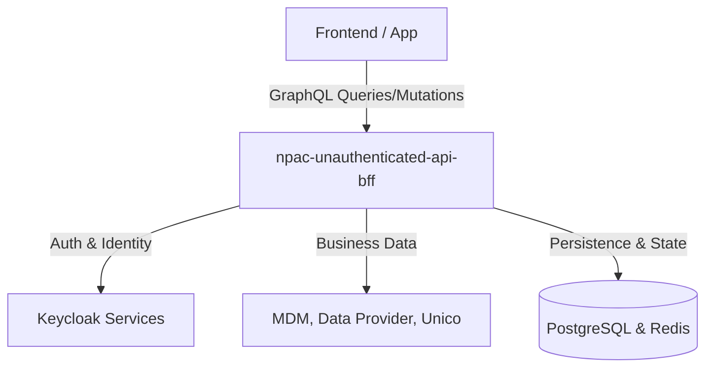
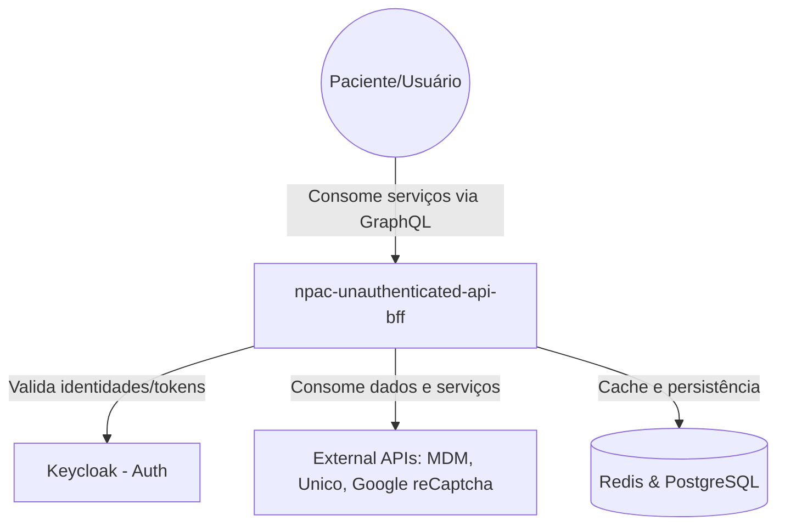
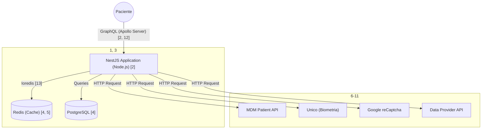

**Blueprint** detalhado da aplicação **npac-unauthenticated-api-bff**. Este projeto é um Backend For Frontend (BFF) desenvolvido para orquestrar serviços não autenticados na jornada do paciente.

## detalhamento técnico estruturado

### 1. Visão Geral da Arquitetura de Software

A aplicação atua como uma camada intermediária (BFF) que consolida múltiplas APIs de backend e serviços de terceiros em uma interface unificada via GraphQL.

### 2. Diagramas de Componentes

Diagrama de Contexto (Nível 1)

Este nível mostra como o sistema interage com usuários e sistemas externos.

Diagrama de Container (Nível 2)

Este nível detalha a estrutura interna da aplicação e as tecnologias utilizadas.

   
A arquitetura interna segue o padrão modular do NestJS, dividindo as responsabilidades da seguinte forma:

 - Resolvers: Atuam como os pontos de entrada para as operações GraphQL, gerenciando Queries e Mutations (ex: AccountValidatorResolver, AuthenticationResolver).
 - Services: Camada que contém a lógica de negócio e as chamadas para APIs externas ou repositórios (ex: AccountValidatorService, AuthenticationBiometryService).
 - Guards: Implementam a lógica de segurança e controle de acesso, utilizando Passport.js.
 - API Config: Módulo centralizado para gerenciamento de endpoints externos via variáveis de ambiente.

### 3. Tecnologias e Stacks

 - Linguagem: Node.js com TypeScript.
 - Framework Principal: NestJS.
 - Interface de API: Apollo Server / GraphQL.
 - Bancos de Dados: PostgreSQL (persistência) e Redis (cache/estado).
 - Comunicação HTTP: Axios.
 - Segurança: Passport, Passport-JWT e Google reCaptcha (v3 e Enterprise).
 - Logs e Monitoramento: Winston, Elasticsearch, Dynatrace e @dasa-logs/plte-log-lib-nestjs.
 - Testes: Jest e Supertest.

### 4. Padrões de Arquitetura

 - BFF (Backend For Frontend): Justificado pela necessidade de agregar dados de diversos microsserviços (MDM, Data Provider, Consent) para simplificar a jornada do usuário final.
 - Arquitetura GraphQL: Permite que o frontend requisite apenas os dados necessários, reduzindo o over-fetching.
 - Service Layer & API-First: Separação clara entre a interface da API e a lógica de processamento de dados.
 - AOP (Aspect-Oriented Programming): Utilizado para funcionalidades transversais como validação e logging.

### 5. Considerações de Infraestrutura

 - Containerização: A aplicação está pronta para ambientes de container, possuindo um Dockerfile dedicado.
 - CI/CD: Pipeline automatizado via Azure Pipelines, com configurações específicas para os ambientes de dev, hml, stg e prd.
 - Escalabilidade e Resiliência: O uso de Redis para cache indica uma estratégia para suportar alta carga e reduzir latência em chamadas repetitivas a serviços externos.

### 6. Integrações

A aplicação possui 67 integrações mapeadas, sendo as principais:

 - Keycloak: Múltiplos domínios para parceiros, funcionários e clientes.
 - Unico: Serviços de biometria facial.
 - MDM (Master Data Management): Consulta de dados de pacientes e integrações externas.
 - Data Provider: Fornecimento de dados sobre unidades, prazos e pagamentos.
 - Google reCaptcha: Proteção contra bots em fluxos de criação de conta e login.

### 7. Justificativas Técnicas

 - TypeScript: Adotado para garantir segurança de tipos em um ecossistema complexo de integrações.
 - NestJS: Escolhido pela sua modularidade e suporte nativo a padrões como Injeção de Dependência, o que facilita a manutenção de um projeto com 120 classes e 15 resolvers.
 - Passport.js: Utilizado para padronizar a autenticação entre os diferentes provedores de identidade (Keycloak, Basic Auth).

### 8. Cross-Cutting Concerns

 - Segurança: Implementada via Guards, validação de tokens JWT e integração com reCaptcha.
 - Observabilidade: Integração nativa com Dynatrace e biblioteca de logs padronizada da DASA para rastreabilidade em produção.
 - Validação: Camada de validação dedicada para garantir a integridade dos inputs recebidos via GraphQL.
 - Health Check: Endpoint específico (/.well-known/apollo/server-health) para monitoramento de disponibilidade pelo orquestrador de containers